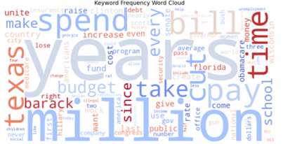
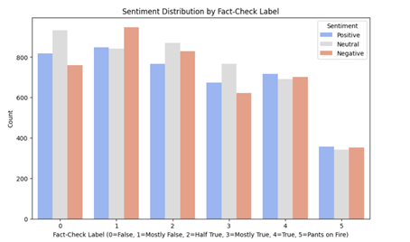
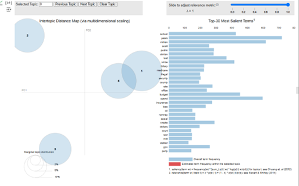
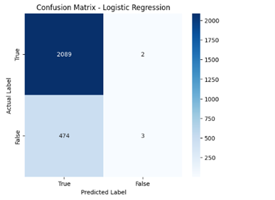
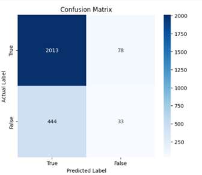
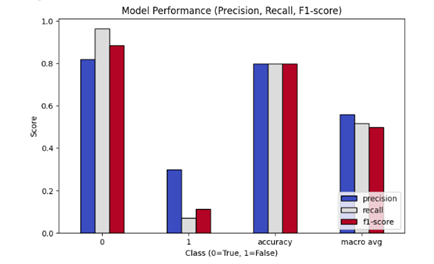
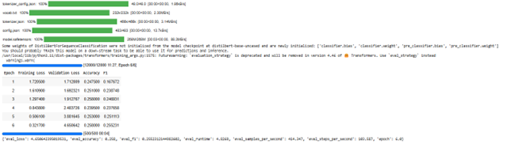

# Analyzing Truthfulness in Political Statements  

**Authors:** Max Roslin & Sophia Remington  
**Institution:** University of Denver, Daniels College of Business  
**Advisor:** Tianjie Deng, Ph.D.  
**Date:** March 11th, 2025  

## Overview  
This project examines political fact-checking statements using the **UCSBNLP/LIAR dataset** from Hugging Face. The goal is to explore **patterns in misinformation, analyze linguistic characteristics, and evaluate machine learning models for classifying truthfulness in political statements**.

The study consists of three key phases:  
1. **Descriptive Analysis** – Exploring dataset structure, statement distributions, and word frequency trends.  
2. **Text Mining Analysis** – Applying **keyword analysis, sentiment analysis (VADER), and topic modeling (LDA)** to examine linguistic differences in true vs. false statements.  
3. **Predictive Modeling** – Implementing **machine learning models (TF-IDF, Logistic Regression, Random Forest, and BERT)** to classify statements based on textual features.

## Dataset  
- **Source:** [LIAR Dataset - Hugging Face](https://www.cs.ucsb.edu/~william/data/liar_dataset.zip)  
- **Contents:** Political statements, speaker details, fact-check ratings, and metadata.

---

## **Methodology and Key Findings**

### **Descriptive Analysis (Exploratory Data Analysis)**
The dataset consists of fact-checked political statements categorized into six truthfulness labels:  
- **False, Mostly False, Half True, Mostly True, True, and Pants on Fire.**  

**Key Findings:**
- The dataset is **imbalanced**, with false and misleading statements being the most common.
- Certain political figures and groups **consistently produced misleading statements**.
- False statements tended to focus on **emotionally charged or polarizing topics**.
- True statements included **more neutral, fact-based language**.

### **Visualizations**
#### **Word Frequency and Keyword Analysis**

#### **Sentiment Distribution by Truthfulness Label**

---

### **Text Mining Analysis**
To uncover deeper linguistic patterns, **three core NLP techniques** were applied:

- **Keyword Frequency Analysis** – Examined the most common words in truthful vs. false statements.
- **Sentiment Analysis (VADER)** – Measured emotional tone in statements.
- **Topic Modeling (LDA)** – Identified four primary themes within political statements:
   1. **Government Spending and Economic Policy**
   2. **Healthcare and Social Issues**
   3. **Elections and Political Processes**
   4. **Legislation and Policy Implementation**  

**Key Findings:**
- False statements **relied more on emotionally charged words**, such as *“illegal,”* *“fraud,”* and *“hoax.”*
- True statements **used more neutral and policy-related terminology**, such as *“budget,”* *“spend,”* and *“fund.”*
- **Topic modeling showed that both true and false statements referenced similar topics**, but false statements tended to use **exaggerated or misleading language**.

#### **Topic Modeling Output (LDA)**

---

### **Predictive Modeling**
Several **machine learning models** were developed to predict whether a statement was **true or false**, using **TF-IDF vectorization, sentiment scores, and topic probabilities**.

#### **Models Tested:**
- **Logistic Regression (Baseline Model)**
- **Random Forest**
- **Fine-Tuned BERT (Transformer-based NLP Model)**  

**Key Findings:**
- **None of the models performed well** in predicting truthfulness.
- **Logistic Regression** provided a basic but **inconsistent** classification performance.
- **Random Forest** struggled with the nuance of political statements.
- **BERT, despite being a powerful NLP model, performed poorly in this context, achieving an F1-score of only 0.258.**
- **Overall, the models lacked sufficient predictive power** to classify statements accurately, likely due to the complexity of political language and limited labeled data.

#### **Confusion Matrix - Logistic Regression**

#### **Confusion Matrix - TF-IDF Model**

#### **Model Performance Metrics**

#### **BERT Model Training Results**

---

## **Conclusion**
The study revealed **significant challenges in using machine learning to classify political statements as truthful or false**. While there are clear linguistic and thematic differences between truthful and misleading statements, **automated classification remains highly inaccurate**.

**Key Takeaways:**
- **Political misinformation often relies on emotional or polarizing rhetoric**, while factual statements are more neutral.
- **Machine learning models failed to accurately classify truthfulness**, highlighting the complexity of political language.
- **BERT, despite being a sophisticated NLP model, was ineffective in this case**, reinforcing the difficulty of automated fact-checking.

Future work could explore **larger datasets, external fact-checking sources, and more advanced language models** to improve predictive accuracy.

---
